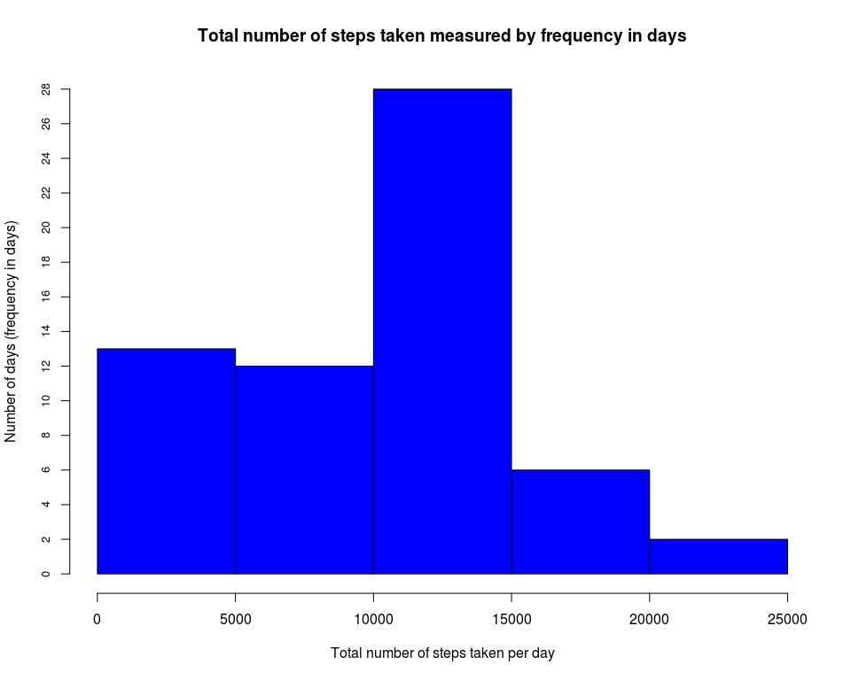
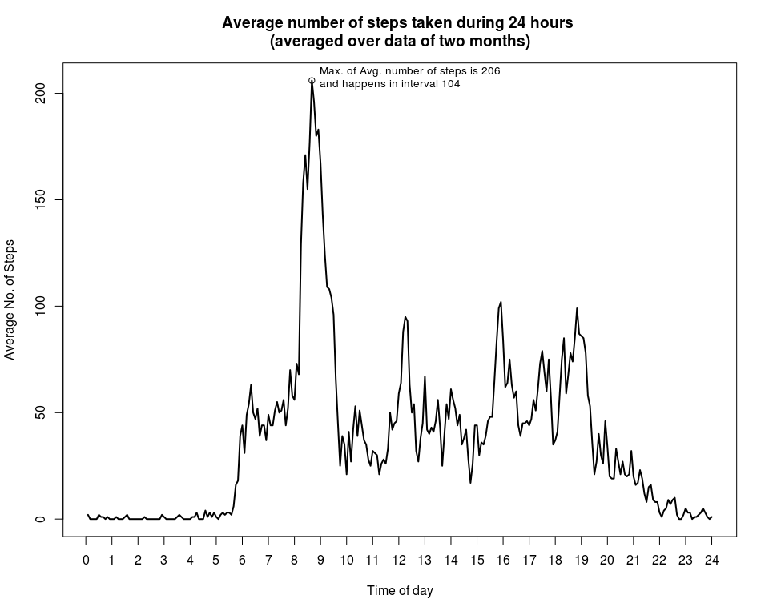
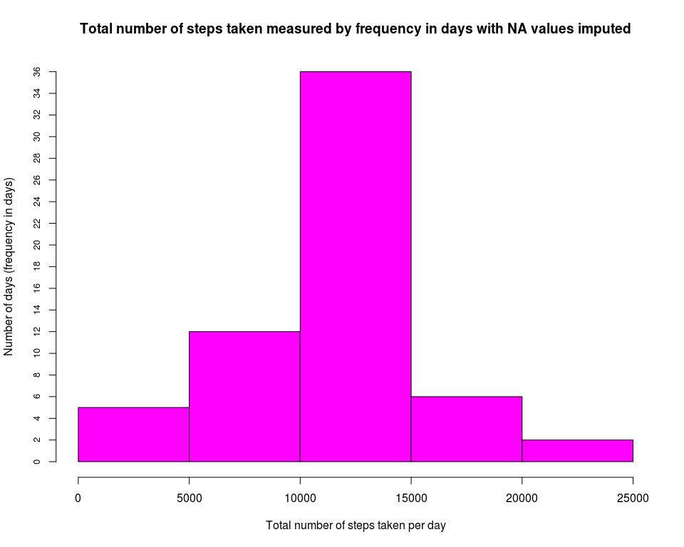
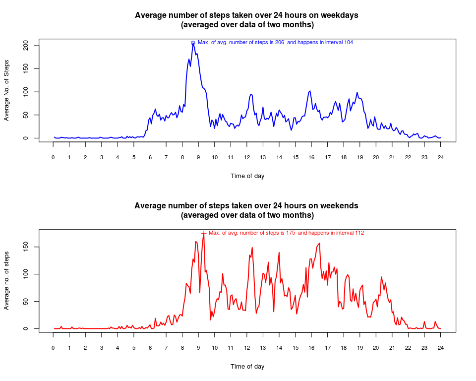

### Submission by Vineet W. Singh - 31/12/2017.

## Personal Fitness Monitoring using activity monitoring devices. 

# Introduction
During the past few years, small and light body activity monitoring devices have become popular due to the affordable prices as well as wide spread availability of such devices. 

A good amount of data collected by such devices has been collated by enthusiasts and volunteers and this data is now available on the internet. 

Enthusiasts like to collect data to maintain their heatlh and/or improve their fitness levels. 

This small study demonstrates as to how the data collected by a personal activity monitoring device can be used to process, interpret, display and provide information about the quantum of activity performed. 

The raw data provided includes the number of steps taken by an anonymous individual, in 5 minute intervals and collected during the months of October and November 2012. 

## Loading and preprocessing the data

The data is loaded into R using the following code


```r
#check to see if unzip datafile exists and load it
if (file.exists('activity.csv')){
  a1<-read.csv('activity.csv')
} else {
  unzip('./activity.zip',exdir='./')
  a1<-read.csv('activity.csv')
}
library(plyr)
```
## What is mean total number of steps taken per day?


```r
#total number of steps taken per day
#apply the sum function after grouping data by date
a2<-tapply(a1$steps,a1$date,sum,na.rm=T)

#make a data frame from the list
a4<-data.frame(names = row.names(a2), a2)
row.names(a4)<-NULL
names(a4)<-c("dates","steps")

#make/display histogram of total number of steps taken per day
#sequence for tickmarks for y axis
s<-seq(0,28,by=2) 

#make the histogram 
hist(a4$steps,xlab="Total number of steps taken per day",
              ylab="Number of days (frequency in days)", col="blue",
              main="Total number of steps taken measured by frequency in days",
              yaxt="n")
axis(2,at=s,labels = as.character(s),cex.axis=0.8)
```

<!-- -->

```r
#mean and median of total number of steps
a41<-round(mean(a4$steps,na.rm=T))
a42<-round(median(a4$steps,na.rm=T))
print(paste("Mean number of steps per day is", a41))
```

```
## [1] "Mean number of steps per day is 9354"
```

```r
print(paste("Median number of steps per day is", a42))
```

```
## [1] "Median number of steps per day is 10395"
```

## What is the average daily activity pattern?

The average daily activity pattern can be infered from the following line chart:

```r
#calculate mean of steps after grouping by 5 min. intervals 
#over all days
a3<-tapply(a1$steps,a1$interval,mean,na.rm=T)

#make a data frame of the list 
a5<-data.frame(names = row.names(a3), a3)
row.names(a5)<-NULL
names(a5)<-c("interval","steps")
a5$steps<-round(a5$steps)

#make a sequence for tick marks and labels
s<-seq(0,288,by=12) 

#plot the line chart
plot(a5$steps,type="l",lty=1,lwd=2,ylab="Average No. of Steps",
     main="Average number of steps taken during 24 hours \n(averaged over data of two months)",
     xaxt='n', xlab="Time of day")
axis(1,at=s,labels = as.character(s/12),cex=0.85)

#get the position of the point where the max happens
a12<-which.max(a5$steps)
a13<-a5[a12,]

#place the point
points(x=as.numeric(row.names(a13)),y=a13[1,2])

#place the label for the point
textLabel<-paste("Max. of Avg. number of steps is", as.character(a13[1,2]), 
                 "\nand happens in interval", row.names(a13))
text(x=as.numeric(row.names(a13)),y=a13[1,2],labels=textLabel,cex=0.85,pos=4)
```

<!-- -->


### Conclusion
Most of the activity happens during the morning hours with the maximum of average number of steps taken is between 8 and 10 in the morning. The maximum average number of steps taken is 206 and this happens between 8:35 and 8:40 in the morning (interval 104). 


## Imputing missing values

Some rows do not contain data. While calculating the mean and median, such rows of incomplete data were ignored. By replacng the not available data with mean values collected at other times we obtain the following results:


```r
#imputation of missing data

#index of missing values
a6<-which(is.na(a1$steps))

#subset rows with missing values from main data set without the steps col.
a7<-a1[a6,2:3]

#print the number of missing values using dimension of the data frame
print(paste("Number of missing values is", dim(a7)[1]))
```

```
## [1] "Number of missing values is 2304"
```

```r
# join the table of missing values with mean values of intervals generated
# earlier and stored in a5 i.e average values of steps grouped by  
# 5 minute invervals over two months
a71<-join(a5,a7,by="interval",type="inner")

#put the data in the right order to re-merge with original data 
#frame
a72<-a71[with(a71,order(date,as.numeric(as.character(interval)))),]

#merge with copy of original data frame
a11<-a1
a11[a6,1]<-a72[,2]

#sum up steps after grouping by date as required
a24<-tapply(a11$steps,a11$date,sum,na.rm=T)

#make a data frame from the list
a43<-data.frame(names = row.names(a24), a24)
row.names(a43)<-NULL
names(a43)<-c("dates","steps")

#sequence for tickmarks for y axis
s<-seq(0,36,by=2) 

#make/display histogram of total number of steps taken per day
hist(a43$steps,xlab="Total number of steps taken per day",
     ylab="Number of days (frequency in days)", col="magenta",
     main=paste("Total number of steps taken measured by frequency in days",
                "with NA values imputed"),
     yaxt="n")
axis(2,at=s,labels = as.character(s),cex.axis=0.8)
```

<!-- -->

```r
#mean and median of total number of steps
a44<-round(mean(a43$steps,na.rm=T))
a45<-round(median(a43$steps,na.rm=T))
print(paste("Mean number of steps (imputed values) per day is", a44))
```

```
## [1] "Mean number of steps (imputed values) per day is 10766"
```

```r
print(paste("Median number of steps (imputed values) per day is", a45))
```

```
## [1] "Median number of steps (imputed values) per day is 10762"
```

### Conclusion.

When the missing values were ignored the mean number of steps per day was 9354 and the median number of steps per day was 10395. 
By imputing the missing values with the mean values of intervals, it is observed that the mean number of steps with the imputed values has increased to 10766 steps. Similarly the median number of steps for the imputed values also shows an increase to 10762 steps.  
An interesting observation is that the mean and median for the imputed values are much closer to each other than in the earlier case of ignoring missing values. 
The histogram made with imputed values shows a marked increase of 8 days for the interval that marks the maximum number of steps taken .This is due to the fact that an average number of 10000 steps per day has been added to the 8 days that earlier had no available data and were not included.   


## Are there differences in activity patterns between weekdays and weekends?


```r
#subset data for when day is on a weekday
a8<-which(weekdays(as.Date(a1$date))!="Saturday" 
          & weekdays(as.Date(a1$date))!="Sunday")
a9<-a1[a8,]

#place the two plot one above the other i.e 2 rows and 1 column
par(mfrow=c(2,1))

#calculate mean of steps after grouping by 5 min. intervals 
#over all days
a31<-tapply(a9$steps,a9$interval,mean,na.rm=T)

#make a data frame of the list 
a51<-data.frame(names = row.names(a31), a31)
row.names(a51)<-NULL
names(a51)<-c("interval","steps")
a51$steps<-round(a5$steps)

#make a sequence for tick marks and labels
s<-seq(0,288,by=12) 

#plot the line chart
plot(a51$steps,type="l",lty=1,lwd=2,col="blue", cex.main=1, 
     cex.lab=0.8, cex.axis=0.8, ylab="Average No. of Steps",
     main=paste("Average number of steps taken over 24 hours on weekdays",
                  "\n(averaged over data of two months)"),
     xaxt='n', xlab="Time of day")
axis(1,at=s,labels = as.character(s/12),cex.axis=0.7) 

#position of point at which max value happens
a15<-which.max(a51$steps)
a16<-a5[a15,]

#place the point
points(x=as.numeric(row.names(a16)),y=a16[1,2],col="blue")

#place the label
textLabel<-paste("Max. of avg. number of steps is", as.character(a16[1,2]), 
                 " and happens in interval", row.names(a16))
text(x=as.numeric(row.names(a16)),y=a16[1,2],col="blue", 
                  labels=textLabel,cex=0.7,pos=4)


#subset data for when day is on a weekend
a10<-which(!(weekdays(as.Date(a1$date))!="Saturday" 
             & weekdays(as.Date(a1$date))!="Sunday"))
a14<-a1[a10,]

#calculate mean of steps after grouping by 5 min. intervals 
#over all days
a32<-tapply(a14$steps,a14$interval,mean,na.rm=T)

#make a data frame of the list 
a52<-data.frame(names = row.names(a32), a32)
row.names(a52)<-NULL
names(a52)<-c("interval","steps")
a52$steps<-round(a52$steps)

#make a sequence for tick marks and labels
s<-seq(0,288,by=12) 

#plot the line chart
plot(a52$steps,type="l",lty=1,lwd=2,col="red", cex.main=1, cex.lab=0.8,
     cex.axis=0.8, 
     ylab="Average no. of steps",
     main=paste("Average number of steps taken over 24 hours on weekends",
                "\n(averaged over data of two months)"),
     xaxt='n', xlab="Time of day")
axis(1,at=s,labels = as.character(s/12),cex.axis=0.7)

#position of point at which max value happens
a17<-which.max(a52$steps)
a18<-a52[a17,]
#place the point
points(x=as.numeric(row.names(a18)),y=a18[1,2],pch=3,col="red")
textLabel<-paste("Max. of avg. number of steps is", as.character(a18[1,2]), 
                 " and happens in interval", row.names(a18))
#place the label
text(x=as.numeric(row.names(a18)),y=a18[1,2],col="red",labels=textLabel,
     cex=0.7,pos=4)
```

<!-- -->

### Conclusion. 
The average number of steps taken on weekends is lower than the number of steps taken on a weekday. The maximum of the average number of steps is about 15% lower on the weekends and happens later in the day on the weekends as compared to weekdays. 
